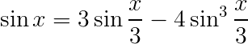

# 练习 1.15

在角（用弧度描述）`x` 足够小时，其正弦值可以用 `sin(x) ≈ x` 计算，而三角恒等式：



可以减小 `sin` 的参数的大小（为完成这一练习，我们认为一个角是“足够小”，如果其数之不大于 0.1 弧度）。这些想法都体现在下述过程中：

```scheme
(define (cube x) (* x x x))

(define (p x) (- (* 3 x) (* 4 (cube x))))

(define (sine angle)
  (if (not (> (abs angle) 0.1))
      angle
      (p (sine (/ angle 3.0)))))
```

a) 在求值 `(sine 12.15)` 时，`p` 将被使用多少次？
b) 在求值 `(sine a)` 时，由过程 `sine` 所产生的计算过程使用的空间和步数（作为 `a` 的函数）增长的阶是什么？

---

## a)

`p` 将被使用 5 次。

## b)

在 `(sine a)` 中，当 `0.1 < a < 0.3` 时，需要迭代一次；当 `0.3 < a < 0.6` 时，需要迭代二次。即 `a` 增大一倍，计算步数增加一个常数，所以 `(sine a)` 的空间和步数增长的阶均为 `O(log a)`。
